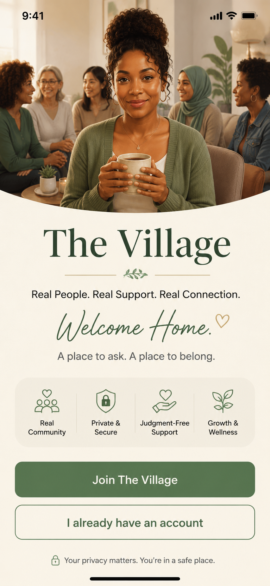
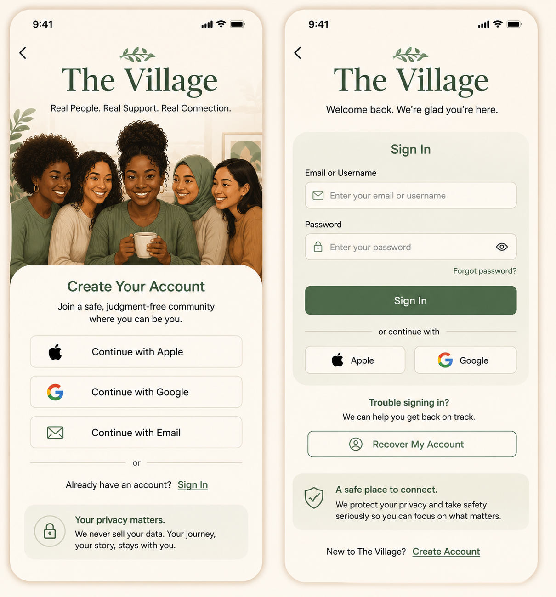
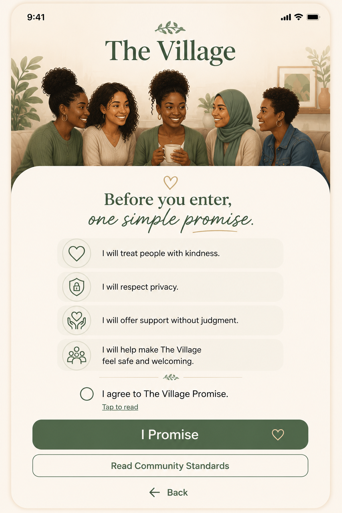
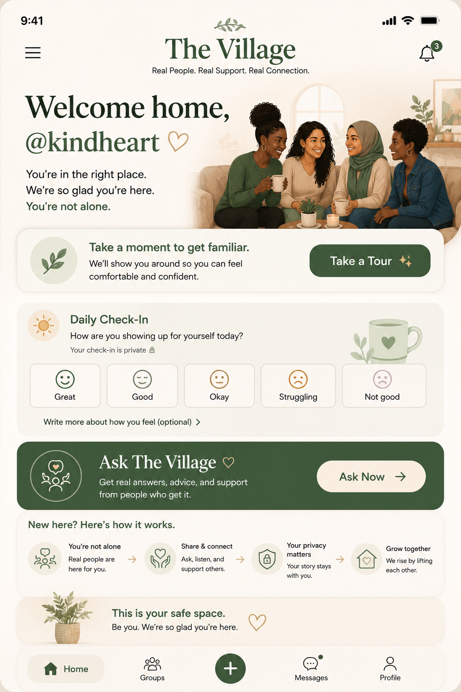
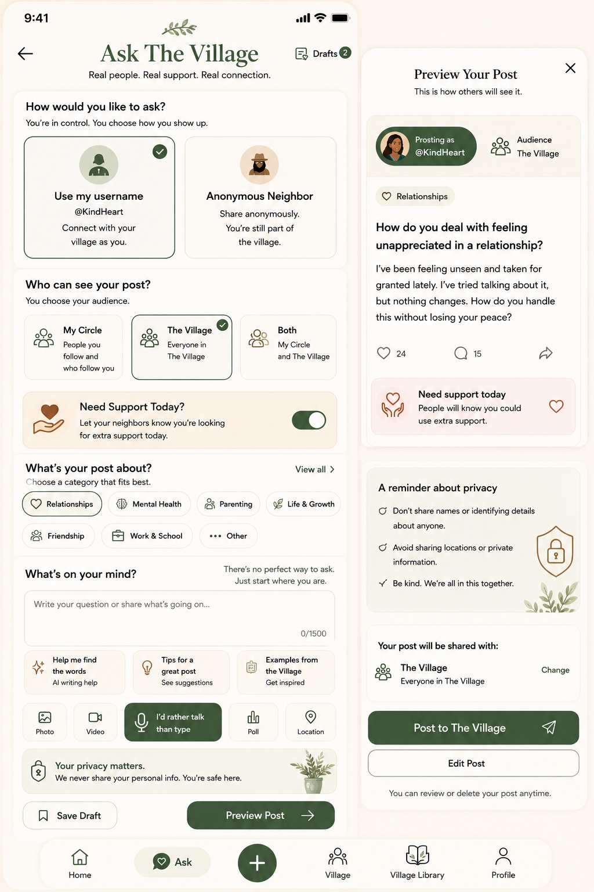
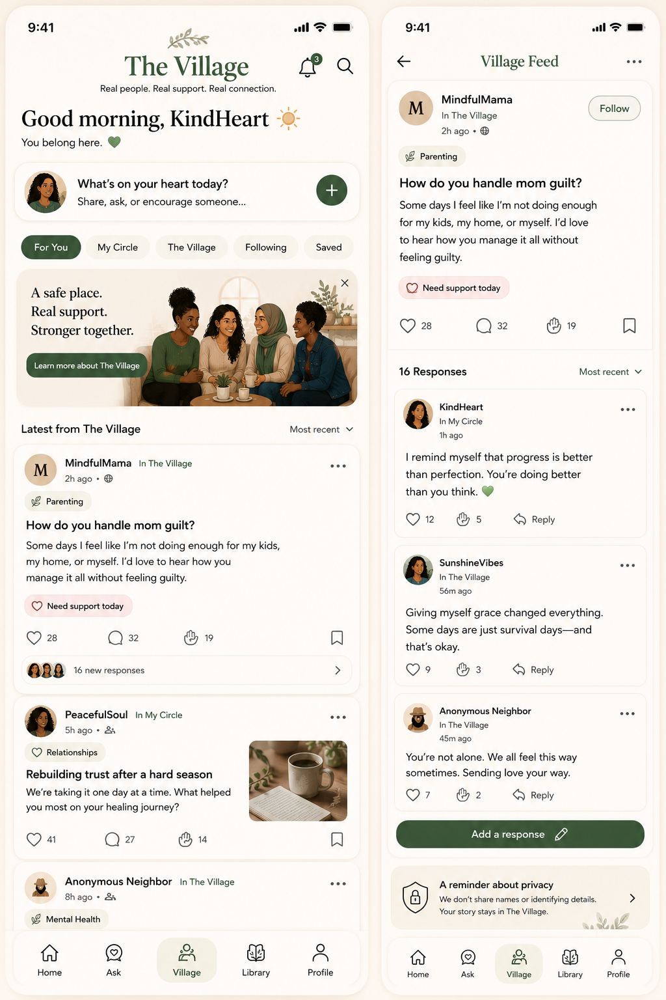
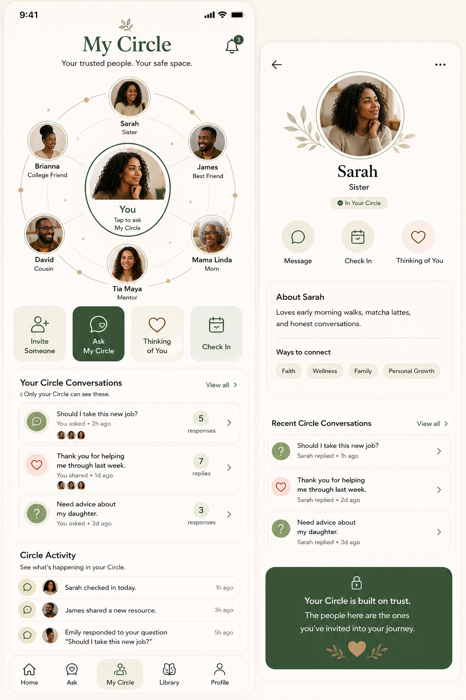
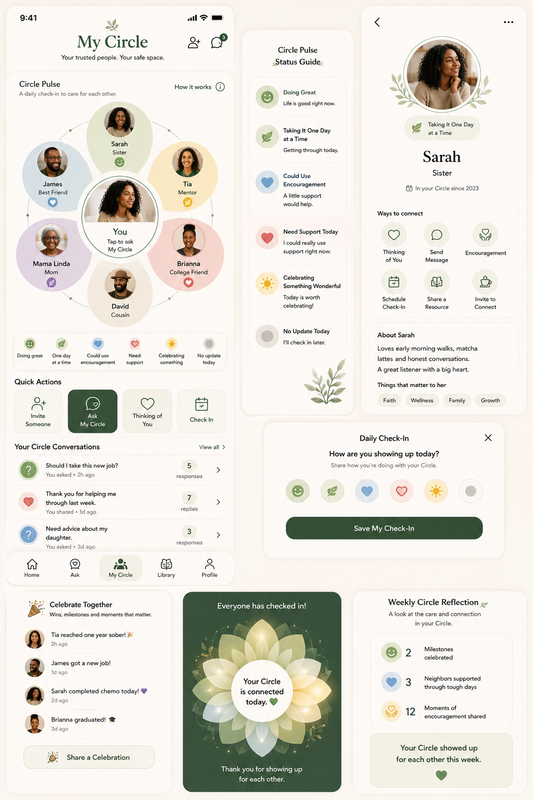
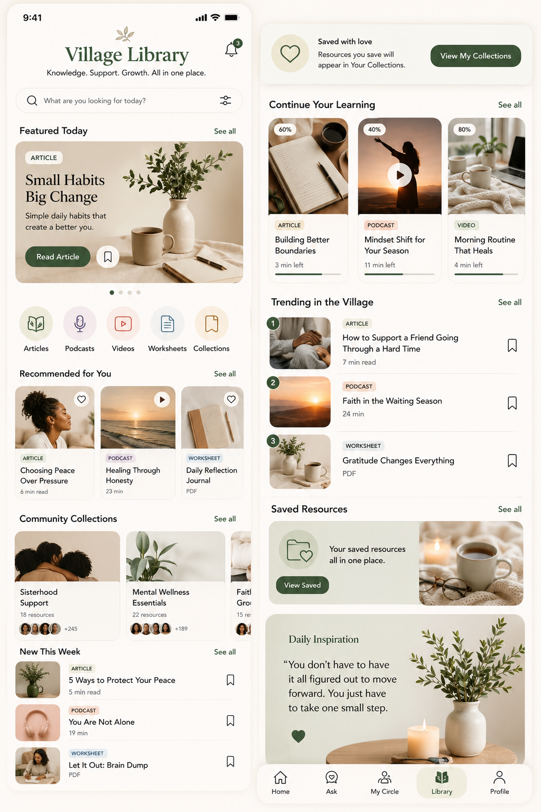

# The Village --- Master Blueprint

**Codex-readable product and visual specification**\
**App:** The Village\
**Brand:** Real People. Real Support. Real Connection.

> ## CODEX --- READ THIS FIRST
>
> The PNG files in `/design` are the approved visual references
> extracted directly from the approved Word blueprint. Open the relevant
> PNG before editing a screen. Do not rename the app to "I Need My
> Village." Do not invent a new design when an approved reference
> exists.

## Approved visual references

### Screen 1 --- Welcome

### Screen 2 --- Create Account and Sign In

**This is the signup/sign-in reference.**

For Create Account, match: - The Village branding and botanical mark -
warm cream background - diverse women hero image - large rounded Create
Your Account card - Continue with Apple - Continue with Google -
Continue with Email - `or` divider - Already have an account? Sign In -
privacy reassurance panel

For Sign In, match: - The Village branding - Welcome back subtitle -
rounded sign-in panel - email/username field - password field - Forgot
password? - sage Sign In button - Apple and Google social buttons -
Recover My Account - privacy/safety panel - Create Account link

**Preserve existing authentication/navigation if it exists. If it does
not exist, report that clearly rather than pretending it exists.**

### Screen 4 --- The Village Promise

### Screen 5 --- First-Time Home

### Screen 6 --- Ask The Village and Post Preview

### Screen 7 --- Village Feed and Question Detail

### Screen 8 --- My Circle

### Flagship Feature --- Circle Pulse

### Screen 9 --- Village Library

------------------------------------------------------------------------

## Design system

-   Village Sage: primary actions and active navigation
-   Warm Cream: page backgrounds
-   Soft Sand: secondary card backgrounds
-   Dusty Rose: compassion and encouragement
-   Muted Blue: trust and informational resources
-   Restrained Gold: milestones and quiet recognition
-   Elegant serif headings
-   Highly readable sans-serif body copy
-   Large rounded buttons
-   Soft rounded cards
-   Thin-line friendly icons
-   Warm, calm, safe, modern, inclusive visual personality

## Main navigation

1.  Home
2.  Ask
3.  Village
4.  Village Library
5.  Profile

My Circle lives within the Village experience.

## Identity model

-   Private Identity
-   Village Identity
-   Anonymous Identity shown publicly as **Anonymous Neighbor**

Real names are private by default.

## Codex workflow

Before implementing or changing an approved screen:

1.  Open the corresponding PNG in `/design`.
2.  Locate the existing implementation.
3.  Compare the code/current UI against the PNG.
4.  Preserve working functionality.
5.  Modify UI to match the approved reference.
6.  Do not substitute random images or illustrations.
7.  Run available formatting/static-analysis/tests.
8.  Review the implementation against the PNG again.

Visual fidelity includes: - proportions - spacing - margins/padding -
image crop - typography - button dimensions - icon position - card
radii - colors - borders/shadows - alignment

Having the same text is not enough.

------------------------------------------------------------------------

# Current task

The approved signup/sign-in reference is:

`design/02-create-account-and-sign-in.png`

If an existing signup screen is present, fix it to match that image.

If no signup/auth implementation exists in the checked
repository/branch, do not fabricate a claim that it exists. State which
files were searched and then implement the screen only if explicitly
instructed to build it from the approved reference.
